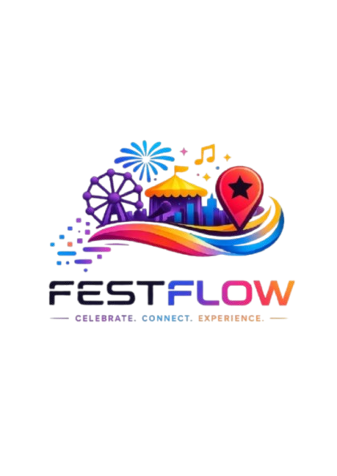

# 🎉 FestFlow – Smart Multi-Fest Event Management Platform

<p align="center">
  
</p>

<p align="center">
  <b>Celebrate • Connect • Experience</b>
</p>

---

## 📖 Overview

FestFlow is a comprehensive web-based platform designed to digitize and simplify the complete lifecycle of college fests, hackathons, workshops, competitions, seminars, and campus events.

The platform enables organizers to create and manage entire festivals while providing participants with a seamless registration experience, QR-based event verification, automated attendance tracking, food distribution management, digital certificates, and centralized event administration.

Unlike traditional event registration systems, FestFlow integrates every stage of event management into a single ecosystem.

---

# 🚀 Key Features

## 🎪 Multi-Fest Management

- Create and manage multiple college fests
- Fest Marketplace
- Publish or unpublish fests
- Fest details management
- Organization information
- Date & venue management

---

## 👨‍💼 Super Admin Panel

- Register a new fest
- Create and manage Admins
- Manage all events
- View analytics
- Publish fest
- Monitor registrations
- Certificate management
- Attendance overview

---

## 🛠 Admin Dashboard

- Create events
- Edit/Delete events
- Registration management
- QR Attendance Scanner
- Food Distribution Scanner
- View participant details
- Generate reports
- Manage certificates

---

## 👨‍🎓 Student Portal

- Student Registration
- Student Login
- Browse Available Fests
- Explore Events
- Register for Events
- View Digital Tickets
- Download Certificates
- View Registration History

---

## 👥 Team Event Management

Supports both

- Solo Events
- Team Events

Team Features

- Team Name
- Multiple Members
- Individual Student Details
- Individual Food Collection
- Individual Certificates

---

## 🎟 QR Ticket System

Each successful registration automatically generates

- Unique QR Code
- Unique Ticket ID
- Digital Event Ticket

QR Ticket is used for

- Attendance Verification
- Food Collection Verification

---

## ✅ Attendance System

Admin scans QR code

↓

Attendance marked

↓

Duplicate attendance prevented

↓

Attendance stored in Firestore

---

## 🍱 Food Distribution System

Separate QR verification

Supports

### Solo Event

- One participant
- One food collection

### Team Event

Every member has

```json
{
  "name": "Surajit Sadhukhan",
  "foodCollected": false
}
```

Each member can collect food independently.

Duplicate food collection is automatically prevented.

---

## 🏆 Certificate Generation

Certificates become available only after

- Attendance = True

Features

- Personalized certificate
- Automatic name insertion
- Event name insertion
- PNG Download
- Separate certificate for every team member

---

# 🏗 System Architecture

```
                     React + TypeScript
                             │
                             │
                     Tailwind CSS + ShadCN UI
                             │
                             ▼
                     Django REST Backend
                             │
             ┌───────────────┼───────────────┐
             ▼               ▼               ▼
Firebase Authentication   Firestore      QR Engine
             │               │
             ▼               ▼
     User Management   Event Database
                             │
                             ▼
                  Certificate Generator
```

---

# ⚙ Tech Stack

## Frontend

- React
- TypeScript
- Tailwind CSS
- ShadCN UI
- React Router
- Lucide Icons
- HTML5
- CSS3

---

## Backend

- Django
- Django REST Framework

---

## Authentication

- Firebase Authentication

---

## Database

- Firebase Firestore

---

## Hosting

Frontend

- Vercel

Backend

- Render

---

## QR Generation

- QRCode Library

---

## Certificate Generation

- HTML2Canvas

---

## Notifications

- Sonner Toast

---

# 📂 Project Structure

```
FestFlow
│
├── public
│   ├── logo-re.png
│   ├── certificate-template.jpg
│
├── src
│   ├── components
│   ├── pages
│   ├── hooks
│   ├── lib
│   ├── types
│   ├── utils
│   ├── App.tsx
│   └── main.tsx
│
├── django-backend
│
└── README.md
```

---

# 🔥 Firebase Collections

## organizers

```
organizers
    uid
        festName
        organizationName
        role
        contactEmail
        startDate
        endDate
```

---

## events

```
events
    title
    description
    date
    venue
    capacity
    eventType
    teamSize
    registrationOpen
```

---

## eventRegistrations

```
eventId
studentId
ticketCode
attendance
teamName

members[]

registeredAt
```

Example

```json
members: [
  {
    "name": "Surajit Sadhukhan",
    "studentId": "12130824021",
    "email": "abc@gmail.com",
    "foodCollected": false
  }
]
```

---

# 🔄 Workflow

## Organizer Workflow

```
Organizer Register

↓

Fest Registration

↓

Become Super Admin

↓

Create Admin

↓

Create Events

↓

Manage Participants

↓

Monitor Analytics
```

---

## Student Workflow

```
Student Register

↓

Browse Fest Marketplace

↓

Choose Fest

↓

Browse Events

↓

Register

↓

Receive QR Ticket

↓

Attend Event

↓

Food Collection

↓

Download Certificate
```

---

## QR Workflow

```
Registration

↓

QR Generated

↓

Attendance Scan

↓

Attendance Updated

↓

Food Collection Scan

↓

Food Status Updated

↓

Certificate Unlocked
```

---

# 🎯 Core Modules

- Multi-Fest Management
- Event Management
- Student Portal
- Admin Dashboard
- Super Admin Dashboard
- QR Attendance
- QR Food Distribution
- Certificate Generator
- Analytics
- Team Management
- Authentication

---

# 💡 Why FestFlow?

Traditional event management relies heavily on manual registration, attendance sheets, spreadsheets, and paper-based certificates.

FestFlow digitizes the complete event lifecycle by integrating registration, event management, attendance tracking, food distribution, team management, and certificate generation into one secure platform.

---

# 📈 Future Enhancements

- AI Event Recommendation
- Mobile Application
- Payment Gateway
- Volunteer Management
- Sponsor Management
- Email Notifications
- SMS Notifications
- Face Recognition Attendance
- NFC Based Check-In
- Live Event Analytics
- Leaderboards
- Event Feedback System

---

# 👨‍💻 Team NovaX

**Project Name**

FestFlow

**Team Name**

NovaX

**Team Members**

- Surajit Sadhukhan (Team Leader)
- Arnisha Mondal
- Banashree Roy
- Samrin Ankhi
- Ankit Das

---

## ⭐ If you like this project, don't forget to star the repository!
